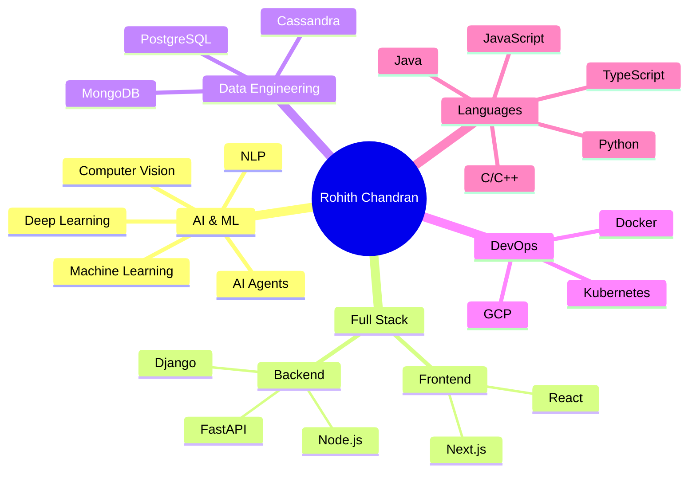

#Hey there, I'm Rohith Chandran 👋

 

## 🌌 About Me

I'm **Rohith Chandran**, a passionate technologist at the intersection of **Full Stack Development** and **Artificial Intelligence**. Currently exploring the fascinating world of **Agentic AI** and building systems that think, learn, and act autonomously.

🔭 **Current Focus:** Developing intelligent AI agents and autonomous systems  
🌱 **Learning:** Advanced AI Agents, LLM Integration, Multi-Agent Architectures  
🤖 **Expertise:** Machine Learning • Deep Learning • Full Stack Development  
💡 **Passion:** Creating AI solutions that solve real-world problems  
📍 **Location:** Kollam, Kerala, India  
✉️ **Contact:** rohithchandran0011@gmail.com  
⚡ **Fun Fact:** I speak 8 programming languages fluently! 🗣️💻

## 🛠️ Technology Arsenal

### Programming Languages

  
  
  
  
  
  
  
  

### AI/ML & Data Science

  
  
  
  
  
  
  

### Web Development

  
  
  
  
  
  
  

### Databases

  
  
  
  
  

### DevOps & Cloud

  
  
  
  

## 📊 GitHub Statistics

  
  

  
  

## 🏆 GitHub Achievements

  

## 💼 Featured Projects

<table>
<tr>
<td width="50%">

### 🎮 CodeQuest-Arena
**Interactive Coding Challenge Platform**

A competitive coding platform where developers challenge each other, solve algorithmic problems, and track progress with real-time leaderboards.

**Tech Stack:**  

[View Project →](https://github.com/rohith-0099/CodeQuest-Arena)

</td>
<td width="50%">

### 🎯 career_bud
**AI-Powered Career Guidance**

An intelligent career recommendation system using ML algorithms to help students and professionals make informed career decisions.

**Tech Stack:**  

[View Project →](https://github.com/rohith-0099/career_bud)

</td>
</tr>
<tr>
<td width="50%">

### 💭 SentimentAnalysis
**Advanced NLP Sentiment Analyzer**

A deep learning-based sentiment analysis tool that processes text data and provides accurate emotion detection using state-of-the-art NLP models.

**Tech Stack:**  

[View Project →](https://github.com/rohith-0099/SentimentAnalysis)

</td>
<td width="50%">

### 🚀 More Projects Coming Soon...
**Stay Tuned!**

Currently working on exciting AI agent projects and automation tools. Follow me to get updates on new releases!

**Focus Areas:**  
- Agentic AI Systems
- LLM Integration
- Autonomous Agents

[Follow for Updates →](https://github.com/rohith-0099)

</td>
</tr>
</table>

## 🎯 Current Mission

**Building intelligent AI agents that can think, learn, and act autonomously**

| 🔭 Working On | 🌱 Learning | 👯 Open To |
|:---:|:---:|:---:|
| Agentic AI Development | LangChain & CrewAI | AI/ML Collaborations |
| Multi-Agent Systems | AutoGPT & Agent Frameworks | Open Source Projects |
| LLM Integration | Advanced Prompt Engineering | Research Opportunities |

## 🌟 Skills Visualization

## 📬 Let's Connect

**I'm always excited to collaborate on innovative projects!**

Whether you want to discuss AI, brainstorm ideas, or just chat about tech, feel free to reach out!

 

 

**"The best way to predict the future is to invent it." - Alan Kay**

 

  

### Thanks for visiting! ⭐

*Don't forget to star some repositories if you find them interesting!*

