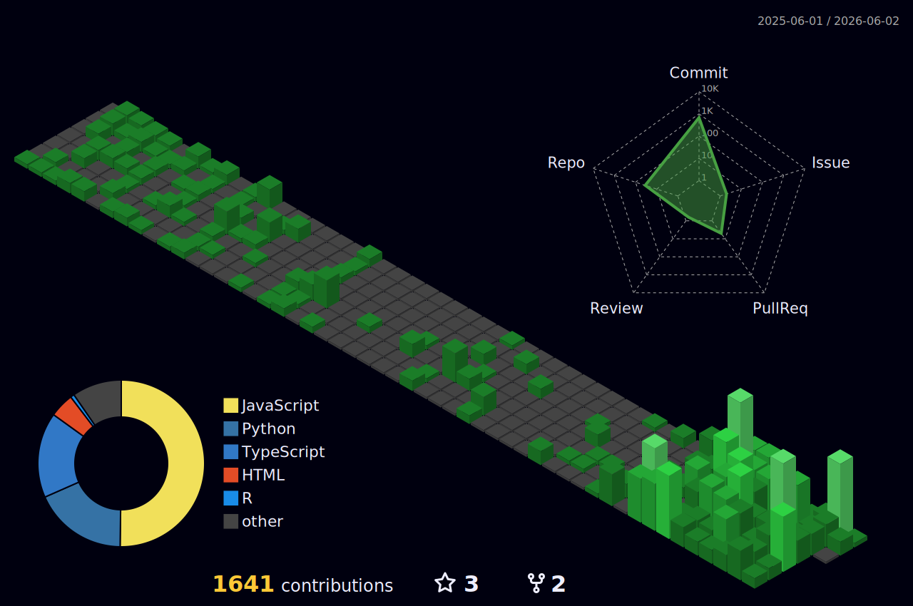

<!-- Banner -->
<p align="center">
  
</p>

<h1 align="center">Rohith</h1>
<h3 align="center">Full Stack Developer</h3>

<p align="center">
  <a href="https://github.com/rohith-0099"></a>
  
</p>

```python
class Rohith:
    role      = "Full Stack Developer"
    languages = ["Python", "TypeScript", "JavaScript"]
    interests = ["Web Development", "System Design", "Open Source"]
```

---

#### Languages

<p>
  
  
  
  
  
</p>

#### Frontend

<p>
  
  
  
  
  
</p>

#### Backend

<p>
  
  
  
  
  
  
</p>

#### Database & Storage

<p>
  
  
  
  
</p>

#### DevOps & Tools

<p>
  
  
  
  
  
  
  
</p>

---

#### Contributions

<p align="center">
  
</p>

---

<p align="center">
  
  
</p>

<p align="center">
  
</p>
